# Documentation

## Table of Contents
- [Introduction](#introduction)
- [Tests](#tests)
  - [GUI React](#gui-react)
  - [GUI TKinter](#gui-tkinter)
  - [CLI](#cli)
 
  
## Tests

### GUI React

#### GUI
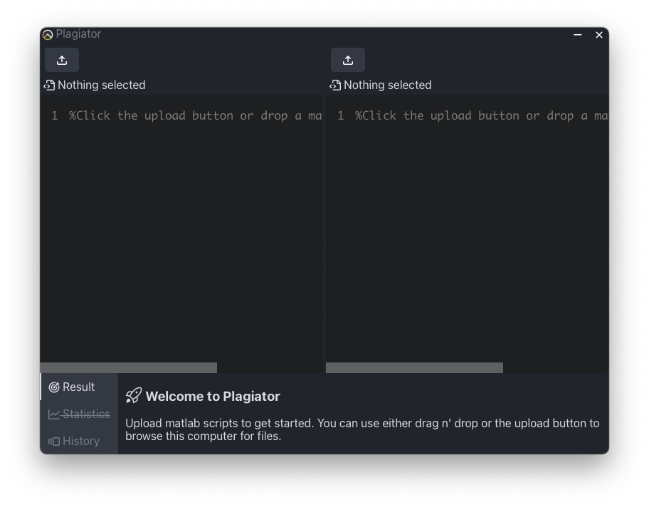

#### GUI - match
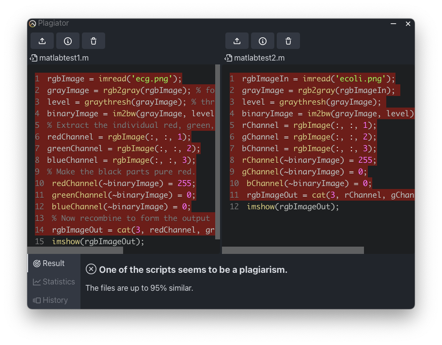

#### GUI - history 
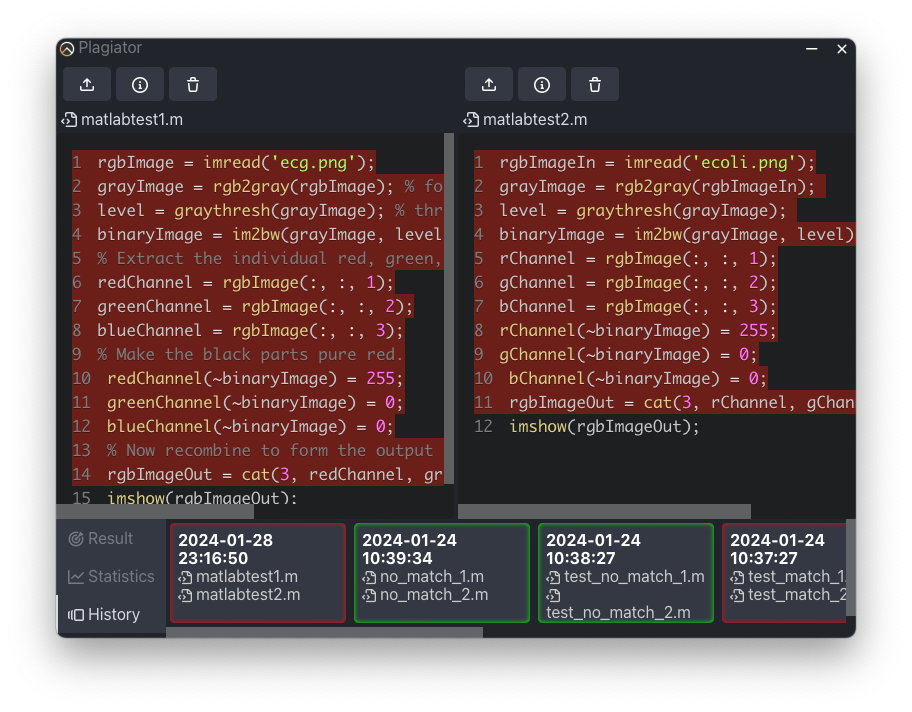

#### GUI - load from history
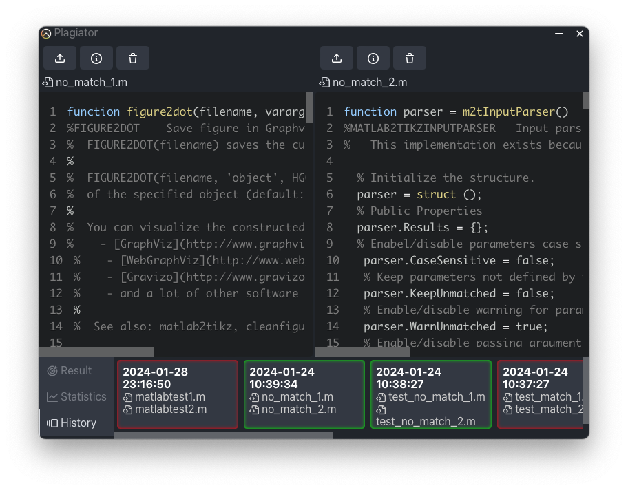

#### GUI - no connection
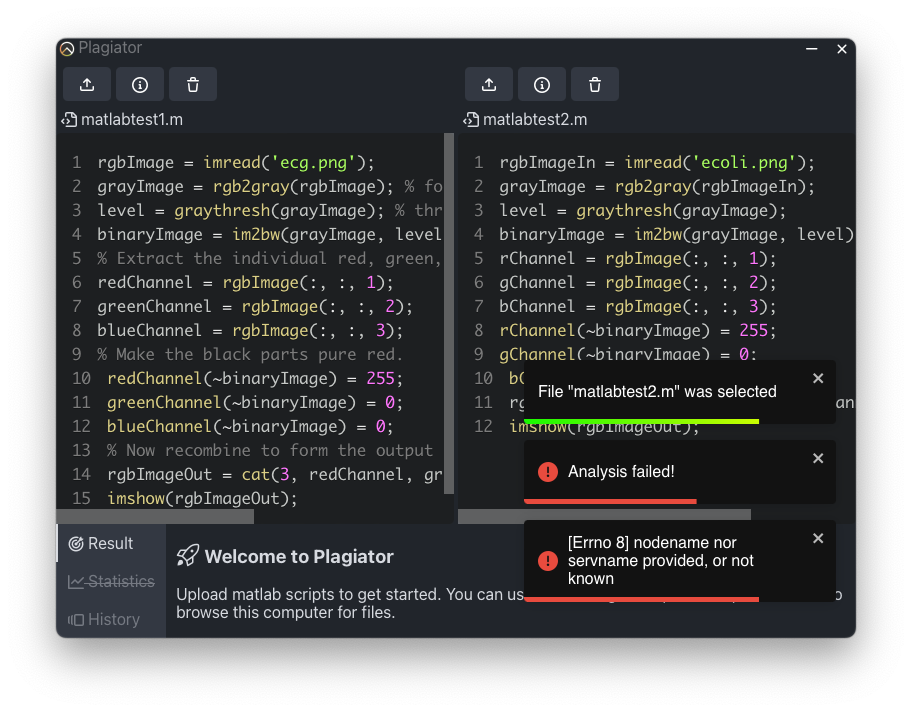

#### GUI - pre analysis
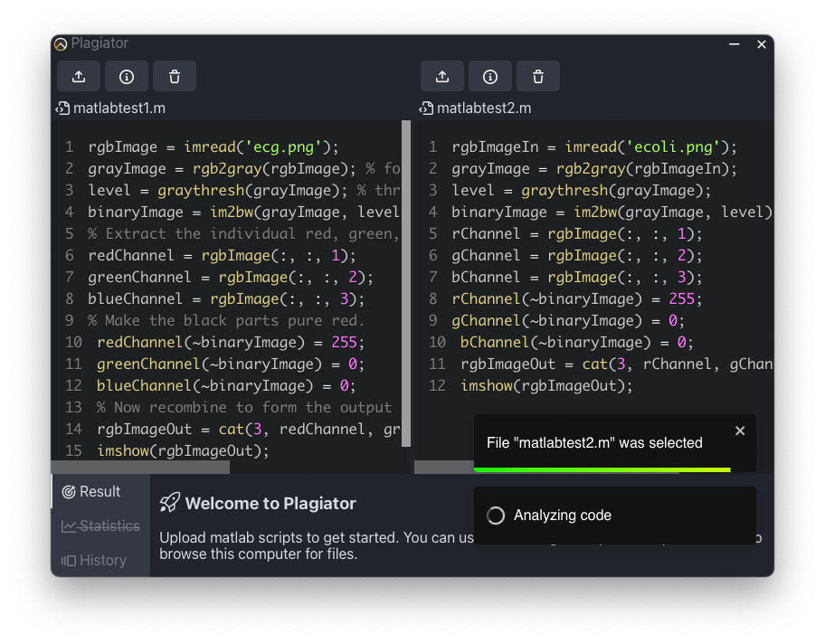

#### GUI - statistic
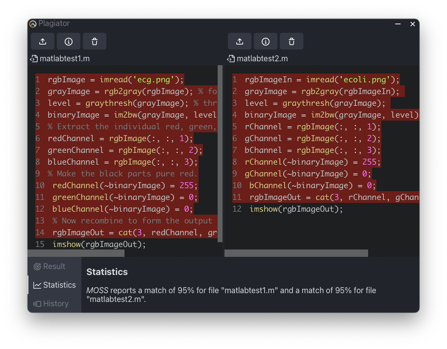

### GUI TKinter

#### Legacy
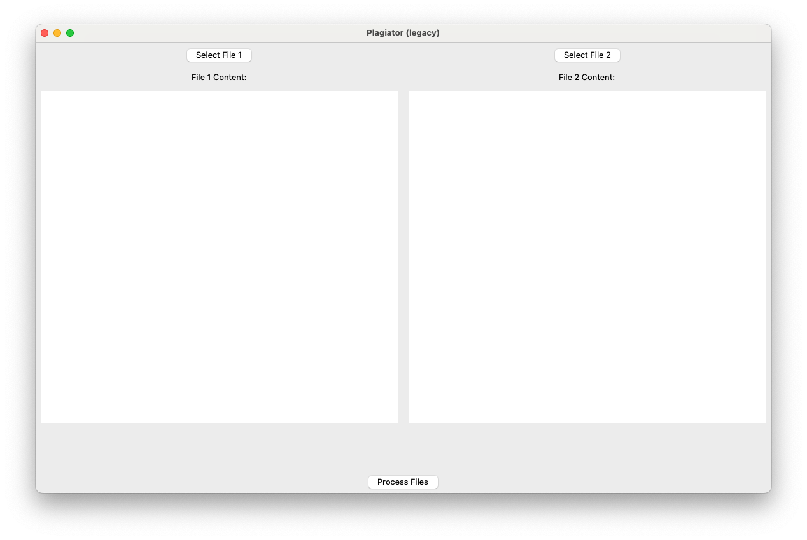

#### Legacy - match
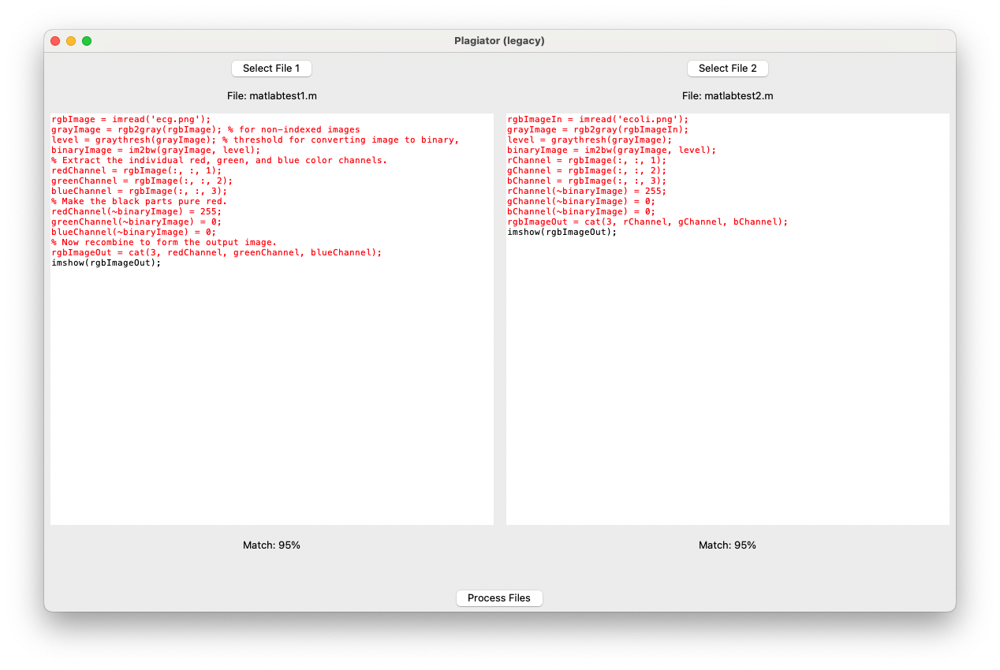

#### Legacy - only one file provided
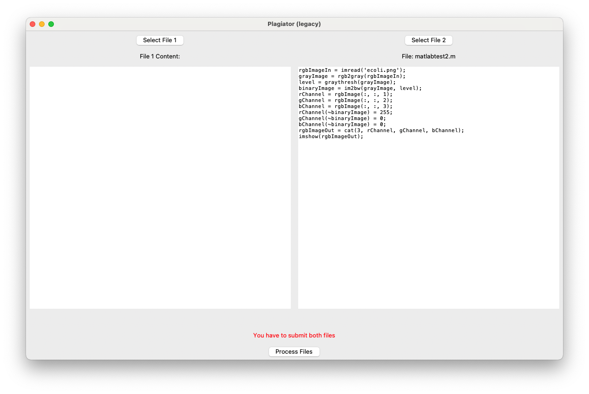

#### Legacy - no file provided
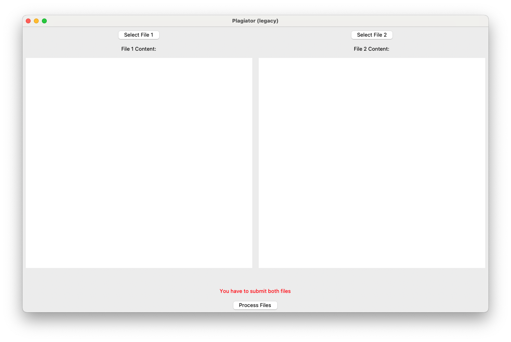

#### Legacy - no connection
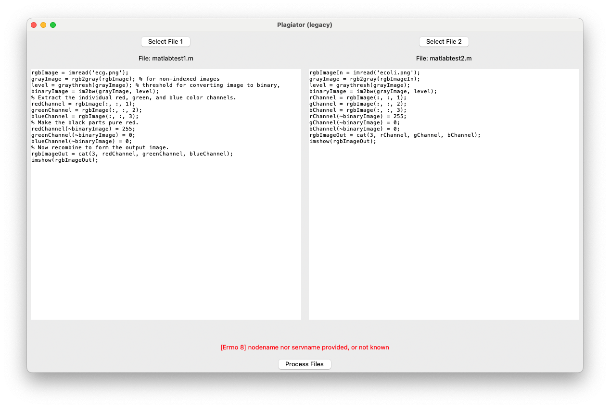

#### Legacy - no match
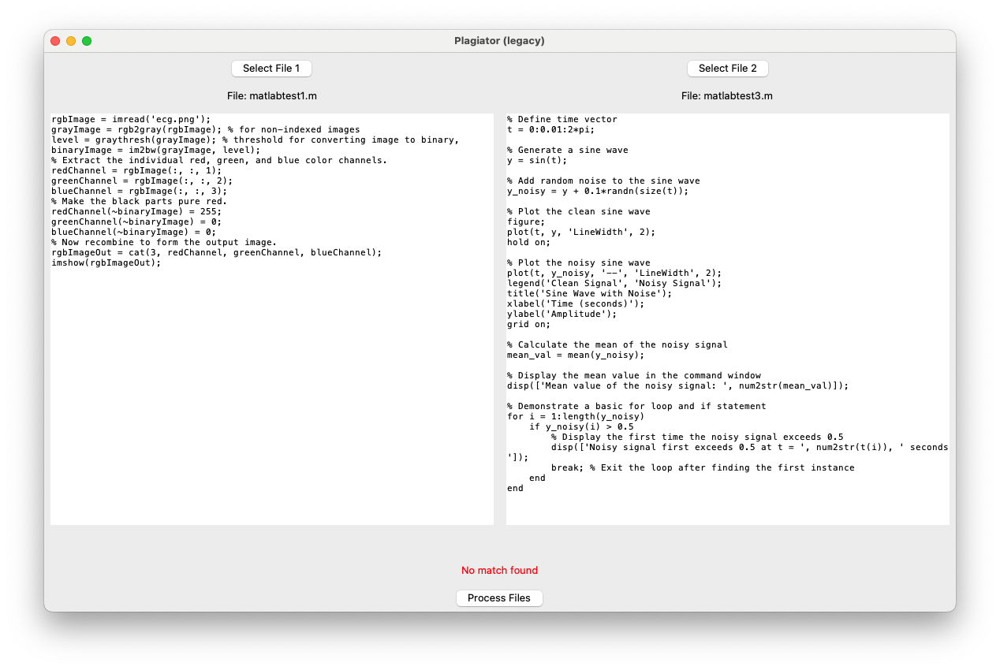

### CLI

#### CLI - Match
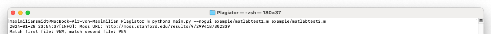

#### CLI - only one file provided
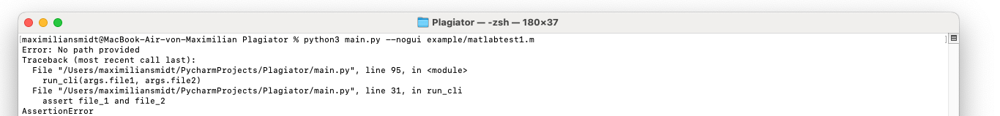

#### CLI - no file provided
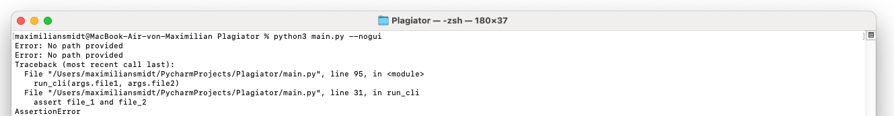

#### CLI - no connection
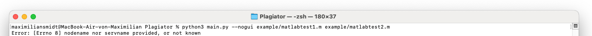

#### CLI - no match
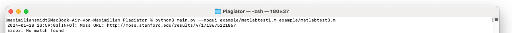